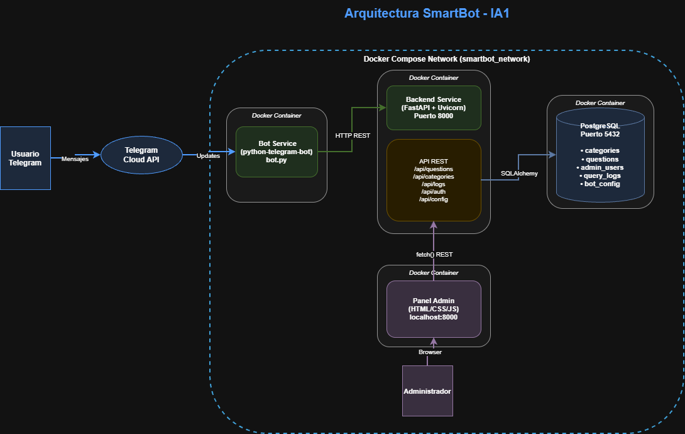
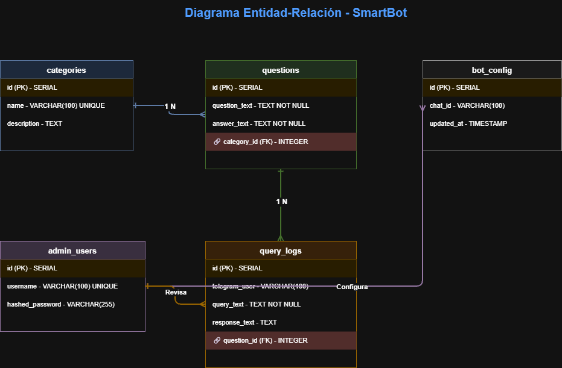

# Manual Tecnico - SmartBot

**Universidad San Carlos de Guatemala**
**Facultad de Ingenieria - Ingenieria en Ciencias y Sistemas**
**Inteligencia Artificial 1 - Practica 2**
**Estudiante:** Pablo Alejandro Marroquin Cutz
**Carne:** 202200214

---

## 1. Descripcion General

SmartBot es un sistema de respuestas automatizadas basado en un bot de Telegram, conectado a una API REST desarrollada en Python con FastAPI y una base de datos PostgreSQL. El sistema permite gestionar preguntas frecuentes desde un panel administrativo web y responderlas automaticamente a los usuarios de Telegram.

---

## 2. Patron de Arquitectura

El proyecto implementa una arquitectura **Cliente-Servidor con capas (Layered Architecture)** compuesta por cuatro capas principales:

| Capa | Componente | Descripcion |
|------|-----------|-------------|
| Presentacion | Panel Admin (HTML/CSS/JS) | Interfaz web para administracion |
| Cliente | Bot de Telegram | Interaccion con usuarios finales |
| Negocio | FastAPI Backend | Logica de negocio y API REST |
| Datos | PostgreSQL | Almacenamiento persistente |

Todos los servicios se comunican a traves de la red interna `smartbot_network` definida en Docker Compose.



El diagrama muestra como el usuario de Telegram envia mensajes a traves de la nube de Telegram, que los reenvía al servicio del bot. El bot consulta la API REST del backend, que a su vez lee y escribe en la base de datos PostgreSQL. El administrador accede al panel web que tambien se comunica con la misma API REST.

---

## 3. Tecnologias Utilizadas

| Tecnologia | Version | Uso |
|-----------|---------|-----|
| Python | 3.11 | Lenguaje principal del backend y bot |
| FastAPI | 0.111.0 | Framework para la API REST |
| Uvicorn | 0.29.0 | Servidor ASGI |
| SQLAlchemy | 2.0.30 | ORM para la base de datos |
| PostgreSQL | 15 | Base de datos relacional |
| python-telegram-bot | 21.3 | Libreria para el bot de Telegram |
| passlib + bcrypt | 1.7.4 / 4.0.1 | Hashing de contrasenas |
| python-jose | 3.3.0 | Generacion de tokens JWT |
| Docker | - | Contenerizacion |
| Docker Compose | - | Orquestacion de servicios |

---

## 4. Estructura del Proyecto

```
Practica2/
├── docker-compose.yml
├── .env
├── README.md
├── Docs/
│   ├── ManualTecnico.md
│   ├── ManualUsuario.md
│   └── Imagenes/
│       ├── Diagrama_Arquitectura_Bot.drawio.png
│       └── Diagrama Entidad-Relacion - SmartBot.drawio.png
├── backend/
│   ├── Dockerfile
│   ├── requirements.txt
│   └── app/
│       ├── main.py
│       ├── database.py
│       ├── models/
│       │   └── models.py
│       ├── routes/
│       │   ├── auth.py
│       │   ├── questions.py
│       │   ├── categories.py
│       │   ├── logs.py
│       │   └── config.py
│       ├── services/
│       │   └── seed.py
│       └── templates/
│           └── index.html
└── bot/
    ├── Dockerfile
    ├── requirements.txt
    └── bot.py
```

---

## 5. Modelo de Datos



El diagrama muestra las cinco tablas del sistema. La tabla `categories` tiene una relacion de uno a muchos con `questions`, ya que una categoria puede agrupar multiples preguntas. La tabla `questions` se relaciona con `query_logs` porque cada consulta registrada hace referencia a la pregunta que fue respondida. La tabla `admin_users` se relaciona con `bot_config` ya que el administrador es quien configura el sistema, y tambien con `query_logs` ya que el administrador es quien revisa el historial de consultas.

### Descripcion de tablas

| Tabla | Descripcion |
|-------|------------|
| `categories` | Categorias para organizar las preguntas frecuentes |
| `questions` | Preguntas frecuentes y sus respuestas |
| `admin_users` | Usuarios administradores del panel |
| `query_logs` | Registro de consultas realizadas por usuarios de Telegram |
| `bot_config` | Configuracion del chat ID de Telegram |

---

## 6. API REST

Base URL: `http://localhost:8000/api`

### Autenticacion
| Metodo | Endpoint | Descripcion | Requiere Auth |
|--------|----------|-------------|--------------|
| POST | `/auth/login` | Inicio de sesion, retorna JWT | No |
| GET | `/auth/me` | Informacion del usuario actual | Si |

### Preguntas
| Metodo | Endpoint | Descripcion | Requiere Auth |
|--------|----------|-------------|--------------|
| GET | `/questions/` | Listar todas las preguntas | No |
| GET | `/questions/{id}` | Obtener pregunta por ID | No |
| POST | `/questions/` | Crear nueva pregunta | Si |
| PUT | `/questions/{id}` | Actualizar pregunta | Si |
| DELETE | `/questions/{id}` | Eliminar pregunta | Si |
| GET | `/questions/search/query?q=texto` | Buscar respuesta por texto | No |

### Categorias
| Metodo | Endpoint | Descripcion | Requiere Auth |
|--------|----------|-------------|--------------|
| GET | `/categories/` | Listar categorias | No |
| POST | `/categories/` | Crear categoria | Si |
| PUT | `/categories/{id}` | Actualizar categoria | Si |
| DELETE | `/categories/{id}` | Eliminar categoria | Si |

### Logs y Estadisticas
| Metodo | Endpoint | Descripcion | Requiere Auth |
|--------|----------|-------------|--------------|
| GET | `/logs/` | Ver historial de consultas | Si |
| POST | `/logs/` | Registrar consulta | No |
| GET | `/logs/stats/summary` | Estadisticas generales | Si |

### Configuracion
| Metodo | Endpoint | Descripcion | Requiere Auth |
|--------|----------|-------------|--------------|
| GET | `/config/` | Ver configuracion del bot | Si |
| PUT | `/config/` | Actualizar chat ID | Si |

---

## 7. Configuracion de Docker Compose

El proyecto utiliza 3 servicios orquestados:

| Servicio | Imagen | Puerto |
|---------|--------|--------|
| db | postgres:15-alpine | 5432 |
| backend | build ./backend | 8000 |
| bot | build ./bot | - |

Red interna: `smartbot_network` (bridge)
Volumen persistente: `postgres_data`

---

## 8. Variables de Entorno (.env)

```env
POSTGRES_USER=smartbot_user
POSTGRES_PASSWORD=smartbot_pass
POSTGRES_DB=smartbot_db
POSTGRES_HOST=db
POSTGRES_PORT=5432
SECRET_KEY=supersecretkey123
ALGORITHM=HS256
TELEGRAM_TOKEN=<token del bot obtenido desde BotFather>
ADMIN_USER=IA1-User
ADMIN_PASSWORD=IA1-password@_new
```

---

## 9. Requerimientos Funcionales

| ID | Descripcion |
|----|-------------|
| RF-01 | El bot responde consultas de usuarios en Telegram |
| RF-02 | El bot muestra categorias disponibles con el comando /categorias |
| RF-03 | El sistema busca respuestas por coincidencia de texto |
| RF-04 | El sistema registra todas las consultas en la base de datos |
| RF-05 | El panel admin requiere autenticacion con JWT |
| RF-06 | El admin puede crear, editar y eliminar preguntas |
| RF-07 | El admin puede crear y eliminar categorias |
| RF-08 | El admin puede ver estadisticas de uso |
| RF-09 | El admin puede configurar el chat ID de Telegram |
| RF-10 | El sistema maneja mensajes sin respuesta registrada |

---

## 10. Requerimientos No Funcionales

| ID | Categoria | Descripcion |
|----|-----------|-------------|
| RNF-01 | Seguridad | Las contrasenas se almacenan con hash bcrypt |
| RNF-02 | Seguridad | El panel admin esta protegido con tokens JWT con expiracion de 8 horas |
| RNF-03 | Rendimiento | El bot responde en menos de 2 segundos por consulta |
| RNF-04 | Disponibilidad | El sistema opera 24/7 gracias a Docker |
| RNF-05 | Mantenibilidad | Las preguntas se gestionan sin modificar codigo fuente |
| RNF-06 | Portabilidad | El sistema se ejecuta con un solo comando Docker Compose |
| RNF-07 | Usabilidad | El panel admin es intuitivo y no requiere capacitacion tecnica |
| RNF-08 | Integridad | No se permiten preguntas duplicadas en el sistema |

---

## 11. Posibles Mejoras Futuras

- Implementar busqueda por similitud semantica con procesamiento de lenguaje natural
- Agregar soporte multiidioma para usuarios internacionales
- Implementar niveles de privilegio para administradores
- Exportar estadisticas a formato CSV o Excel
- Agregar sistema de notificaciones automaticas al grupo de Telegram